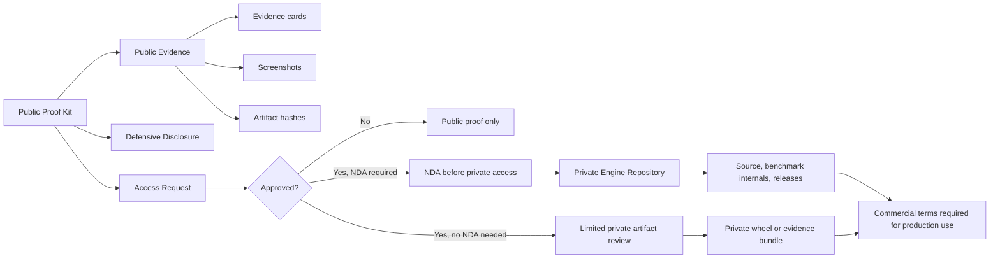

# Private-Core / Public-Proof Model

This project uses a split model.

The private engine stays closed. The public proof kit explains the work, publishes public-safe evidence, and gives serious reviewers a way to request private access.

## Public Layer

The public layer is for:

- discovery
- review
- proof-of-existence
- public-safe benchmark evidence
- access requests

It does not include source code or private package artifacts.

## Private Layer

The private layer is for:

- engine source
- implementation review
- private release artifacts
- benchmark internals
- private pilots
- commercial diligence

Private access is controlled by written permission and may require an NDA.

## Commercial Layer

Private access does not grant commercial use.

Commercial use, hosted deployment, resale, embedding, sublicensing, AI-platform integration, model-training use, or production use requires a separate written agreement.
